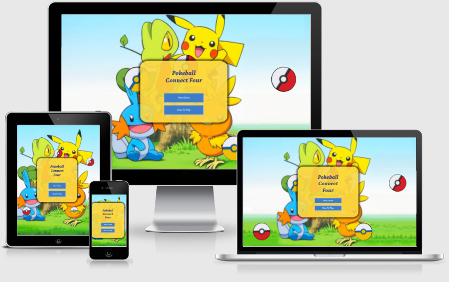

# **Pokeball Connect Four- MS2**
    

For live website [click here](https://rajendradanve.github.io/connectfour)

#   **Table of Content**

 1. About(#about)
 2. [UX](#UX)
    *   [Project Goals](#project-goal)
    *   [Player Goals](#player-goal)
    *   [Developer Goals](#developer-goals)
    *   [User Stories](#user-stories)
    *   [Design](#design)
    *   [Wireframe](#wireframe)

 2. Features
    *   [Existing Features](#existing-features)
    *   [Features Left to Implement](#features-left-to-implement)

3.  [Technologies-Used](#Technologies-Used)

4.  [Testing](#Testing)

5. [Deployment](#Deployment)

6. [Credit](#Credit)
    *   [Content](#content)
    *   [Media](#media)
    *   [Code](#code)
    *   [Acknowledgements](#acknowledgements) 

 # **About**
 Connect four is classic game which is not only fun to play but also required stragergic thinking. 
Pokeball connect four uses Pokeball theme with this game. 
This is 2 player game and game board has 7 wide and 6 high grid cell where player put the his coins.
First player who able to put four of his coins either in a stright row, column or diagonal (without any 
other coins inbetween is the winner).

 # **UX**

##  **Project Goal**
Main goal of the project is develop fun, exciting and stragergic game which 
can be played alone or with friend. Game is designed mainly for kids of age 5+ years. 
Game can also be played by adults for brain trigger. 
This game is a developed as a part of "Interactive Front-End Development Milestone Project" 
with the use of frontend technologies such as  HTML, CSS and Javascript. 

## **Targeted Audiance**

- This game is mainly meant to be used specially by kids which help then to spend time while developing 
   stragergic thinking.
- This is 2 player game but can be played alone while second player is computer. 
- Kids can play this game with parents and another friend . 
- Of course, adults can play this game just to time pass when they want to relax and wanted some challanging 
  task while relaxing.
- This game is not gender specific and can be played by any gender. But in general pokemon is more popular 
   in boys than girls so mostly themewise this is more suitable for boys.

##   **Player Goal**

**Goal for Kid** 
    
* Easy and fun game to play which also teaches to think stratergically.
* Easy controls so that kids can play easily.
* Can be played alone (with computer as 2nd player) or with family member or friend.
* Simple understandble instructions about how to play game.
* Audio interaction suitable for game.

**Goal for Parent**

* Game which is easy to play but also will teach my kid about how to think logically.
* Interative controls or with easy to understand function.
* Easily understanble and accesable instructions if required.
* Game which parent can able to play with kid and generate bond.
* Just game which will not divert kids with any unwanted advertisements.

## Developer Goal
To develop game which has
* Shows developers understanding about Interactive frontend development.
* Simple design which mainly suitable for kids can easily understandable and easy to play.
* Big buttons which are suitable for screen size. 
* Dyanamic grid design based on screen size.  
        

## **User Stories**

-**General Player**
Simple, fun game which can be played by anyone. While playing it can also challange brain and can teach stragergic and 
logical thinking.

-   **As a kid (age 5 to 10 year) , I want**

* Easy to use screen layout with less buttons
* Game where I can play with less controls
* Game which I can play alone and also with friends or with my parent
* Game which will think me to think stratergically

-   **As a Parent, I want**
* Easy and simple screen layout so that my kids can play game easily
* Simple and minimal control 
* No advertisement so that kids are not getting divert to unwanted stuff
* Learn to develop logical thinking ability while playing
* Able to play with my kid just for fun to generabe parental bonding together
    
-   **As a Adult, I want**
* Some brain trigger while relaxing
* Able to play without much other distractions (advertisement)
* Able to play with friend or kids

## **Design Choice**

- **Colour Scheme**
Main colors used are from got from pokemon theme colour which as mainly yellow, blue and navy blue color. 
Color codes taken from [this link](https://brandpalettes.com/pokemon-color-codes/)

- **Typography**
Petrona font is mainly used through out the website with serif as a back up font in case of any reason the font isn't being imported into the site correctly.
Petrona looks stylish but still clean font to read and correctly goes with simple design. Fonts are imported using [Google Fonts](https://fonts.google.com/).

- **Pages**
Game has mainly 2 pages. Index.html page for choosing second player and game.html page for main game page.
Also error.html page is design in case there is any error in the game. 

-   **Wireframes**

[Desktop wireframe](assets/wireframe/Wireframe-for-desktop.pdf)

[Tablet wireframe](assets/wireframe/Wireframe-For-Tablet.pdf)

[Mobile wireframe](assets/wireframe/Wireframe-Phone.pdf)

## **Features**

### **Existing Features**

-   Index Page: Main feature of index page is to choose opponent player and provide instruction about how to play game.
    To justify pokeball theme page has background image from pokemon. Also page has animated red and yellow pokeball.
    It is possible to choose second player as another human or computer. 
    
-   Game Page: Game page has 3 buttons - refresh, home and music toggle. Main game board has 7 columns and 6 rows.
    One more of the top row is used to insert the coin. When second player is computer yellow pokeball coin will be played randomly.

-   Music on and off switch - which allows the users to switch on the music if they would like to. 

-   If any player won or game is draw , further coin playing is not possible. 

### **Features Left to Implement**

-   Choosing who will play first in case one of the player is computer. 

-   Possibility for player to choose the pokeball.

-   Logical moves by computer when one of the player is computer.

## **Technologies Used**

### Languages Used

- [HTML5](https://en.wikipedia.org/wiki/HTML#:~:text=The%20HyperText%20Markup%20Language%2C%20or,displayed%20in%20a%20web%20browser.)

  - The language used to give the site its main structure and all necessary features.

- [CSS3](https://en.wikipedia.org/wiki/CSS)

  - The language used to give the application its visual effects including the font, color and layout etc.

- [Javascript](https://developer.mozilla.org/en-US/docs/Web/JavaScript)

  - The language used to implement the site's interactive features, allow the users to be interactive and make actions during their visit.

### Frameworks, Libraries & Programs Used

- [Bootstrap](https://getbootstrap.com/)

    - Bootstrap library is used create responsive design, beautiful buttons, modal template.

- [Jquery](https://jquery.com/)

    - Jquery library used create DOM elements, event handling, animation.

- [Github](https://github.com/)

  - Github is used to create, store and maintain all codes in a repository.

  - Github is also used as the site hosting service for the final website to be published on.

- [Git Version control](https://git-scm.com/)

  - Git 2.31.1 for Mac is used for commit and push codes to Github.

- [Google Fonts](https://fonts.google.com/)

  - The font used for text is imported from google fonts.

- [Fontawesome](https://fontawesome.com/)

  - The icons used for this game are taken from fontawesome.

- [Balsamiq](https://balsamiq.com/)

  - The wireframes were created using Balsamiq.

- [Google DevTools](https://developer.chrome.com/docs/devtools/)

  - Google DevTools was extensively used throughout the project for various styling, testing and debugging purposes.

- [Am I Responsive](http://ami.responsivedesign.is/)

  - Am I responsive to create the mock-up image presented at the start of this document.

- [W3C Markup Validation service](https://validator.w3.org/)

  - W3C Markup Validation Service has been used to test the HTML codes.

- [W3C CSS Validation Service](https://jigsaw.w3.org/css-validator/)

  - W3C CSS Validation Service has been used to test the CSS codes.

        add below div in the footer
        
Icons made by <a href="https://www.freepik.com" title="Freepik">Freepik</a> from <a href="https://www.flaticon.com/" title="Flaticon">www.flaticon.com</a>

        Font family
        font-family: 'Petrona', serif;
font-family: 'Roboto', sans-serif;

Credits

oops image
<a href="https://www.freepik.com/vectors/clouds">Clouds vector created by jcomp - www.freepik.com</a>