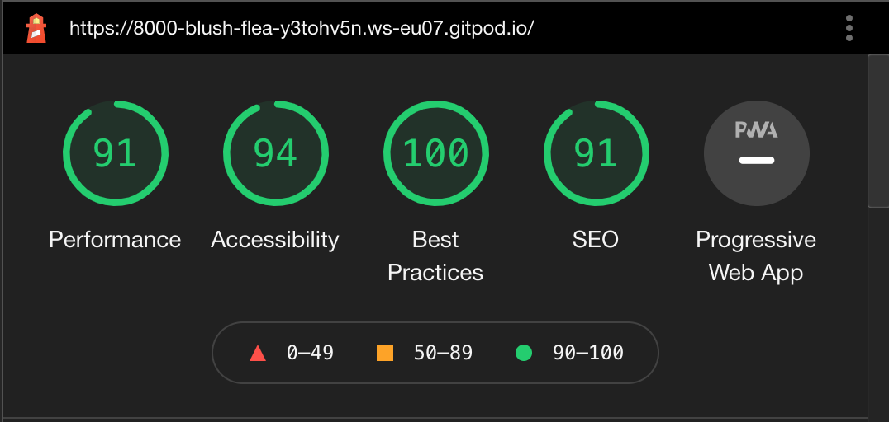
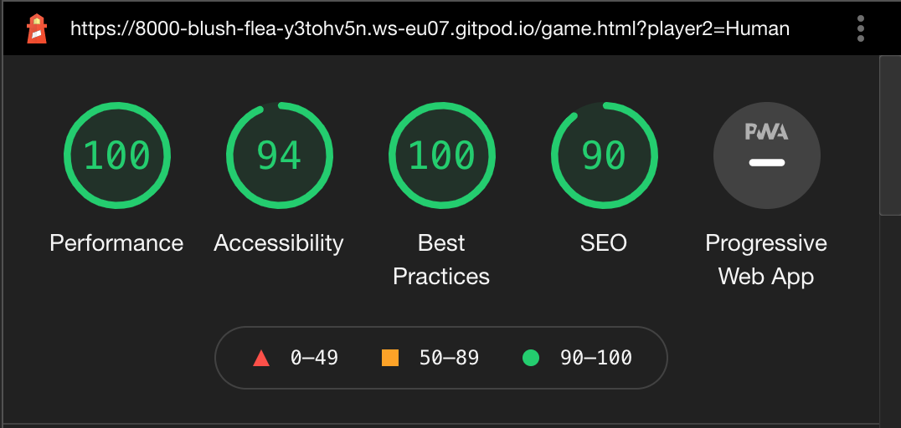

# **TESTING**

## **HTML**
HTML is validated using online [HTML Validator](https://validator.w3.org/) tool.
-   **index.html:** Validation showed an error that "Element h4 not allowed as child of element label"
    h4 element removed from the label instead   is used to show player name bellow icon.
    After this, no error was shown for the index.html page.
-   **game.html:** Validation showed an error that "Attribute type not allowed on element audio at this point".
    Removed "type" attribute from audio element to remove an error.

## **CSS**
CSS is validated using online [CSS Validator](https://validator.w3.org/) tool.
-   **style.css :** Validation showed error that "scrollbar-width property doesn't exist" and "-ms-overflow-style" is an unknown vendor extension
    This is not removed as this CSS property is used to hide the scrollbar for a page on firefox and EDGE browser for as mentioned in [this link](https://www.w3schools.com/howto/howto_css_hide_scrollbars.asp)

## **Javascript**
Javascript is validated using online [JSHint](https://jshint.com/) tool.
-   **main-page.js :** Received warnings related to use of let and use of $ sign which can be ignored.

-   **game-script.js :** Received warning related to use of let, template literal syntax, and use of const which can be ignored.

## **Testing Based on User Stories**

### **General player**
As the aim of the game was to make it a simple game with minimal controls and avoid distractions of any kind. 
After testing the index.html page, I released that when I use the radio button user has to perform one click extra to enter the game.
To avoid this I changed the radio option to buttons that will directly redirect to the game by choosing the correct option of 2nd player.
icons are used inside buttons to provide visual information about with whom users want to play. This also provides a better look.

### **Kids**
- For kids aim was to have a simple and easy screen layout.
  The main page has only 2 buttons with attractive background. One button to enter a new game which provides an option to choose an opponent player. 
  The second button provides instructions about how to play the game. It is assumed that parents will explain instructions to the kids who can not read.
  Images are provided to show different possibilities of winning the game.
  The game page has 3 buttons and the main game layout. The game can be played with only a simple left-click to the correct row. 
  Maximum available spaced tried to use for the game board. 

-   Game with few controls.
    On the main page, there are 2 main buttons and buttons to choose the player. 
    On the game page, there are 3 buttons to refresh/restart the game, go to the homepage and music toggle button. 
    The game can be played simply left-click at the column where the user wanted to put a Pokeball coin.

-   Game which can be played alone or with a friend/family
    Pokeball connects four is a 2 player game. But the option is provided to play against the computer. 
    Currently, the computer is taking random places to put a coin. In a future version of the game, some more logic can be added to computer moves to make the game more challenging.

-   Game to teach strategic thinking
    A basic aim of the game to make strategic moves of the coin to win. Kids will learn to think and observe before making decisions.
    
### **Parents**
-   Destraction free layout
    The layout is quite simple and aims to increase focus while playing the game. On the main page, some animation was added to generate interest. 
    On the game page, big icons are added and most of the space is used for the game board. This page has only 3 controls. 
    Fancy looks and a lot of animation are avoided. 

-   Able to develop logical thinking while playing.
    This game is a logical game and the player has to think before playing his moves. 

### **Adult**
-   Need some brain activity while relaxing
    The game is quite simple and just need to think logically before playing your moves.
    Few controls to enter the game.

Some of the testing cases for parents and adults are already covered in general players and kids players.

## **Further Testing**
*   The Chrome extension [Responsive Viewer](https://chrome.google.com/webstore/detail/responsive-viewer/inmopeiepgfljkpkidclfgbgbmfcennb?hl=en) has been run and checked.
*   Website tested on [Mobile-Friendly Test - Google Search Console](https://search.google.com/test/mobile-friendly) and validated correctly.
*   Run style sheet code through [Autoprefixer CSS online](http://autoprefixer.github.io/) and pasted prefixed code back into the style sheet.
*   The website has been checked on devices such as large screens, laptops, tablets, and Android phones of different sizes.
*   The website has been opened on Safari, Chrome, and Mozilla both on phones and laptops to check for any display issues across browsers.
*   My kids, wife, and friends have been asked to provide feedback and if any potential major issues.
*   Website performance is tested using [Google Lighhouse](https://developers.google.com/web/tools/lighthouse) and below are the screenshot from the result
    *   index.html page

        

    *   game.html page

        
        
## **Manual Testing**
*   **Index Page**
    *   Checked animation on index page for different screen sizes and if Pokeball size changes with screen. 
    *   Checked if the "New Game" button works properly and opens the modal to choose an opponent player. 
    *   Checked if game instructions buttons "How To Play" works properly and text in the modal is okay in all sizes. 
    *   Checked hovering effect for all buttons works properly. 
    *   Checked if the game redirects correctly to the game page after choosing an opponent player.

*   **Game Page**
    *   Game tested many times checking different winning and draw cases to test if all conditions work. 
        Received the wrong result once while testing but not able to replicate the same case again. Played the game much time afterward to check all cases.
    *   Played game with kids and family members to test game if works as intended.
    *   Checked if all links work properly.
    *   Checked if the music toggle works properly. 
    *   Checked if tooltip text works properly.
    *   Checked if game board layout changed based on screen size (after refresh)

## **Known Bugs**
Not a bug but it will be better to add some logical thinking to the computer moves instead of random to make the game more competitive. 
    